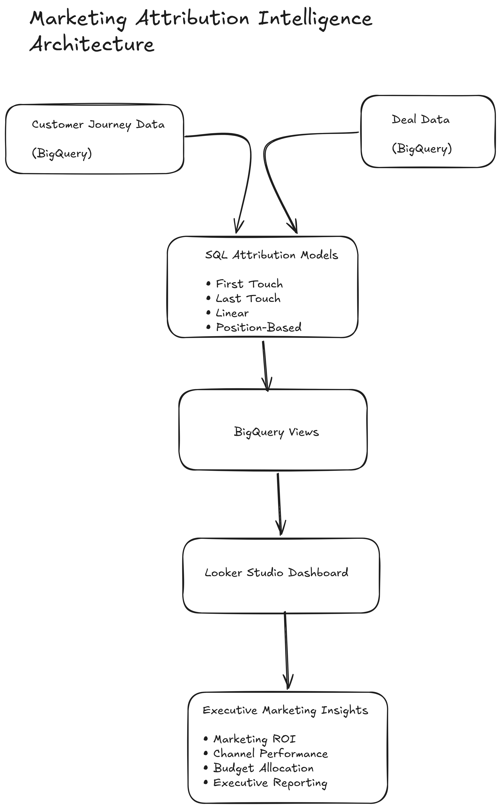

# Marketing Attribution Intelligence Dashboard

A marketing analytics prototype demonstrating how multi-touch attribution models can be implemented using BigQuery, SQL and Looker Studio to provide marketing teams with greater visibility into channel performance and revenue attribution.

---

# Executive Summary

This project recreates a real-world marketing attribution workflow similar to one that could be used within a growing organisation to improve marketing reporting and strategic decision-making.

Instead of relying solely on last-click attribution, this solution compares multiple attribution methodologies, enabling marketing teams to understand how different customer touchpoints contribute to revenue generation.

The project combines SQL-based attribution modelling, cloud data warehousing and executive dashboarding into a single reporting solution.

---

# Business Problem

Marketing teams often invest across multiple acquisition channels including:

- Google Ads
- Organic Search
- Email Marketing
- LinkedIn Ads
- Direct Traffic

Traditional reporting frequently attributes revenue to only the final interaction before conversion, hiding the contribution of earlier marketing activities.

This limits visibility into:

- Channel effectiveness
- Campaign ROI
- Budget allocation
- Customer acquisition strategy
- Marketing performance optimisation

---

# Project Objective

Build a scalable attribution reporting solution capable of:

- Consolidating customer journey data
- Storing marketing data inside BigQuery
- Applying multiple attribution models
- Comparing attribution methodologies
- Delivering executive dashboards for marketing decision-makers

---

# Solution Architecture



# Solution Overview

The solution consists of four main stages.

### 1. Customer Journey Data

Customer interactions are stored with:

- Customer ID
- Marketing Channel
- Touch Date

---

### 2. Deal Data

Revenue data is stored separately containing:

- Customer ID
- Deal Stage
- Deal Value
- Close Date

---

### 3. Attribution Modelling

SQL transformations generate four attribution models:

- First Touch Attribution
- Last Touch Attribution
- Linear Attribution
- Position-Based Attribution (40-20-40)

Each model creates its own reusable BigQuery View.

---

### 4. Executive Dashboard

Looker Studio connects directly to BigQuery and visualises:

- Revenue by Marketing Channel
- Attribution Comparison
- Pipeline Value
- Customers
- Revenue Distribution
- Attribution Tables

---

# Attribution Models

## First Touch Attribution

Credits 100% of revenue to the customer's first recorded marketing interaction.

Business Use

- Demand Generation
- Brand Awareness
- Top-of-Funnel Investment

---

## Last Touch Attribution

Credits 100% of revenue to the final interaction before conversion.

Business Use

- Conversion Optimisation
- Sales Enablement
- Bottom-of-Funnel Reporting

---

## Linear Attribution

Revenue is distributed equally across every customer touchpoint.

Business Use

- Multi-channel performance analysis
- Balanced marketing measurement

---

## Position-Based Attribution

Revenue allocation:

- 40% First Touch
- 20% Middle Touches
- 40% Last Touch

Business Use

- Full-funnel marketing analysis
- Executive marketing reporting

---

# Dashboard Features

Executive KPIs

- Total Pipeline Value
- Total Attributed Revenue
- Number of Customers
- Total Marketing Touchpoints

Visualisations

- Revenue by Marketing Channel
- Revenue Distribution
- Attribution Model Comparison
- Marketing Performance Tables

---

# Technology Stack

## Cloud

- Google BigQuery

## Business Intelligence

- Looker Studio

## SQL

- Standard SQL
- Window Functions
- CTEs
- Joins
- Aggregations

## Version Control

- Git
- GitHub

## Documentation

- Markdown
- Notion

---

# Repository Structure

```
multitouch-attribution-engine/

├── sql/
│   ├── 01_create_customer_journey.sql
│   ├── 02_create_deals.sql
│   ├── 03_insert_customer_journey.sql
│   ├── 04_insert_deals.sql
│   ├── 05_first_touch_attribution.sql
│   ├── 06_last_touch_attribution.sql
│   ├── 07_linear_attribution.sql
│   └── 08_position_based_attribution.sql

├── views/
│   ├── first_touch_view.sql
│   ├── last_touch_view.sql
│   ├── linear_attribution_view.sql
│   └── position_based_view.sql

├── docs/
│   └── data-model.md

└── README.md
```

---

# Key Skills Demonstrated

Marketing Analytics

Marketing Attribution

Marketing Performance Reporting

BigQuery

SQL

Looker Studio

Cloud Data Warehousing

Business Intelligence

Marketing Strategy

Data Modelling

Executive Reporting

Git & GitHub

---

# Business Impact

This project demonstrates how marketing organisations can move beyond traditional last-click reporting by implementing multiple attribution models that provide a more balanced understanding of channel contribution.

The solution enables marketing leaders to compare attribution methodologies, identify high-performing acquisition channels and support more informed budget allocation decisions.

---

# Future Improvements

Potential enhancements include:

- GA4 export integration
- Google Ads API integration
- Automated BigQuery scheduled queries
- Incremental data pipelines
- dbt transformations
- Marketing Mix Modelling
- Customer Lifetime Value analysis
- Power BI version
- Tableau version

---

# Disclaimer

This project is a professional portfolio prototype created to demonstrate marketing analytics, SQL and attribution modelling techniques using representative marketing data. It recreates the type of analytical workflow that could be implemented within a real marketing environment.